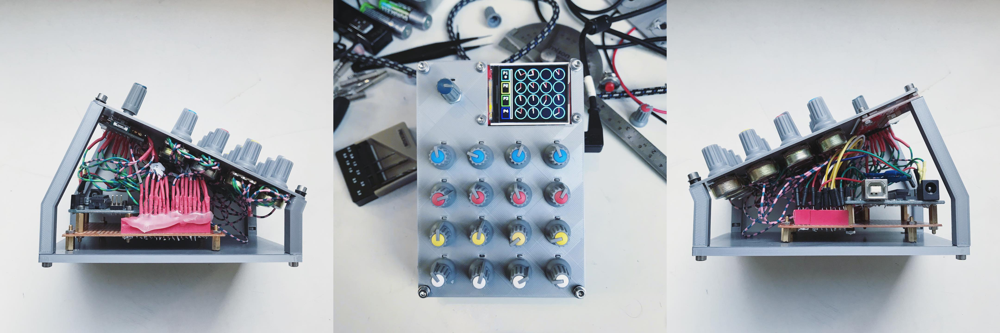

# 4BY4



4BY4 is a prototype MIDI / OSC / WebSockets controller. It does one key thing differently to other controllers: when changing between "pages" of assignments, values are locked ( ie. do not send ) until the position of the knob returns or passes the previously recorded position. This is so that assignments don't "jump" when you go to tweak them. 

**Visual Feedback**

To indicate the state of the knob ( *locked or unlocked* ), an LCD is used to display the original value alongside the current knob position, and is highlighted in red until the knob position passes it. 

**Pots vs Encoders**

The design can be thought of as a low-cost alternative to using rotary encoders, such as on controllers like the [MIDI Fighter Twister](https://www.midifighter.com/#Twister). Rotary encoders have the benefit of no fixed start or end point, but the downside of having less fidelity than potentiometers (unless very expensive), as well as lacking the tactile feel of an analogue potentiometer. A single rotary encoder is used in the prototype for switching between pages, but could also be replaced by push buttons, a touchscreen etc.

**Sending Messages**

When connected via USB, the 4BY4 doesn't immediately send MIDI / OSC / WebSockets, and insteads sends serial messages directly over USB from the device, with 10bit / 1024 points of fidelity. The [bridge.js](bridge.js) script will forward those messages onto MIDI, OSC or WebSockets. It's possible to load MIDI firmware onto the Arduino - or use a [Teensy](https://www.pjrc.com/teensy/) - and skip this process, but will reduce the amount of fidelity to MIDI 7bit / 128 points.

# Parts

The prototype was built with spare parts I had floating around in boxes, many from Arduino starter kits (ie. Uno + TFT + rotary encoder):

* **16 x 1K Linear Potentiometers** - make sure to get *linear* instead of logarithmic potentiometers
* **1 x [MUX74HC4067](https://www.sparkfun.com/products/9056)** - chip for multiplexing 16 unique inputs into a reduced number of pins
* **1 x [1.8" TFT](https://www.adafruit.com/product/358)** - standard low cost TFT, drawn to via SPI ([Serial Peripheral Interface](https://learn.sparkfun.com/tutorials/serial-peripheral-interface-spi/all))
* **1 x [Rotary encoder](https://www.hobbyelectronica.nl/product/rotary-encoder-module/)** - standard low cost encoder, PPA ([Pulses Per Rotation](https://www.cuidevices.com/blog/what-is-encoder-ppr-cpr-and-lpr)) relates to the amount of clicks in a 360 degree rotation
* **1 x [Arduino Uno](https://store.arduino.cc/products/arduino-uno-rev3)** - or equivalent

# Usage

**Prerequisites**

* [Node](https://nodejs.org/en/download/package-manager/) and [pnpm](https://pnpm.io/) - pnpm is interchangeable with npm or [yarn](https://yarnpkg.com/)
* [Arduino IDE](https://www.arduino.cc/en/software/) or [CLI](https://github.com/arduino/arduino-cli)

**Arduino**

[4BY4.ino](4BY4.ino) can be opened in the Arduino IDE and uploaded there, or if you have [arduino-cli](https://github.com/arduino/arduino-cli) installed run it with `./compile.sh`, after making sure to set `BOARD_TYPE` and `BOARD_PORT` in [config.env](config.env):

```
BOARD_TYPE=arduino:avr:uno
# use "arduino-cli board list" to find BOARD_TYPE

BOARD_PORT=/dev/cu.usbmodem1D131
# use "ls /dev/tty*"" to find BOARD_PORT
```

**Bridge**

```
pnpm i 
pnpm start
```

Once the sketch is uploaded to the Arduino, you can run the bridge script which will forward serial messages into MIDI, OSC or WebSockets. This is done with `pnpm start`. To configure OSC, make sure to set `OSC_ADDRESS` and `OSC_PORT` in [config.env](config.env):

```
OSC_ADDRESS=0.0.0.0
# the IP of the computer your OSC messages will be sent to
# 0.0.0.0 is localhost

OSC_PORT=4444
```

Check [package.json](package.json) for a list of scripts which can be run.

# Wiring

```
=======================
POTENTIOMETERS x16 (1K)
=======================

MIDDLE PINS = Multiplexer C0-C15
LEFT PINS = 5V zig-zagged
RIGHT PINS = GND zig-zagged

=========================
MULTIPLEXER (MUX74HC4067)
=========================

C0-C15 = Potentiometer Center Pins
S0 = Arduino D3
S1 = Arduino D4
S2 = Arduino D5
S3 = Arduino D6
EN = Arduino D7
SIG = Arduino A0

========
TFT 1.8"
========

SCK/CLOCK = Arduino D13
SDA/MOSI = Arduino D11
CS/SS/NSS/SELECT = Arduino D10
A0/DC = Arduino D9
RST/RESET = Arduino RESET

==============
ROTARY ENCODER
==============

CLK = Arduino D12
DT = Arduino D8
SW = N/A
```

# TODO

* make a KiCad design with through-hole potentiometers
* use better quality potentiometers, and correct resistor values
* switch MIDI / OSC / WebSockets script into GUI panel

# Misc

Some resources I found helpful while building this:

* [Aduino Uno Layout](arduino.jpeg)
* [MIDI firmware for Uno](arduino.jpeg)
* [Teensy SPI Pinout](arduino.jpeg)
* [Teensy Pinout - All](https://www.pjrc.com/teensy/pinout.html)
* [1.8" TFT Tutorial](https://randomnerdtutorials.com/guide-to-1-8-tft-display-with-arduino)
* [1.8" TFT Tutorial - Adafruit](https://learn.adafruit.com/1-8-tft-display/breakout-wiring-and-test)

# License

MIT
